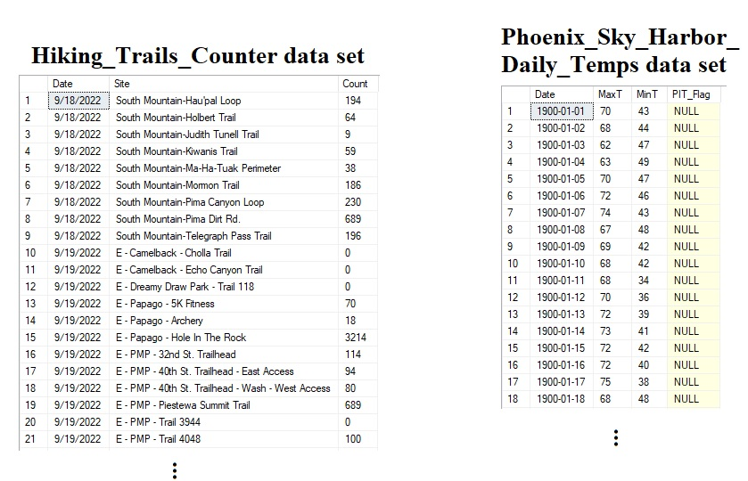
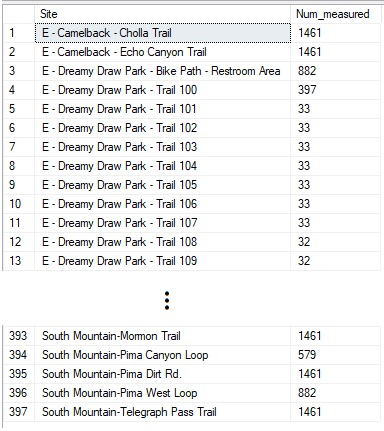
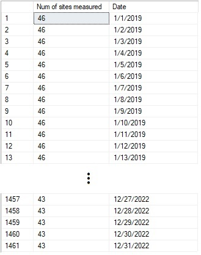
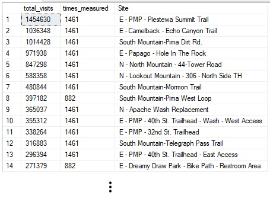
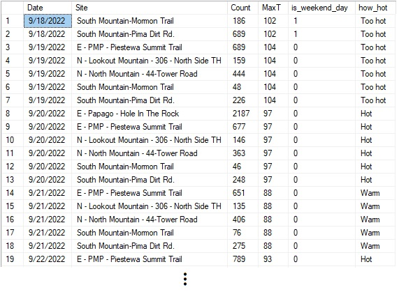
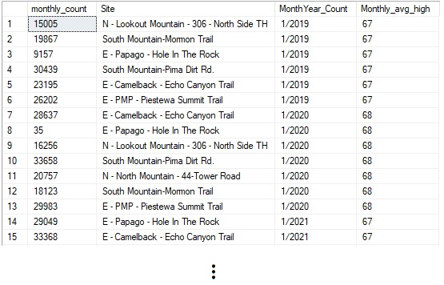

# Hiking in Phoenix

## Summary

I recently moved to Phoenix, Arizona for work, and I am eager to learn more about the city and and its culture. As an avid hiker and data scientist, I found that studying the trends of Pheonix's vibrant and active population is a natural way to discover interesting activities and meet like-minded individuals. 

In this project, I use the popular Data Analysis tools __SQL__ and __Tableau__ to investigate which hiking trails in the city are most popular and what factors may influence that activity. Some fun insights and conclusions that we will discover in this project are that there is a significant correlation between number of hikers on the trails and the weather (most of the hiking happens in Phoenix's winters) and that there is much more hiking happening on the weekends. We will also see that some hiking trails are still active in the summer, indicating that the trail may be shady and a way to escape the heat! 

## Description

We investigate two data sets using popular Data Analysis tools: SQL and Tableau. The first data set consists of sensor data from various hiking trails in the city of Phoenix, Arizona. The data set can be found on the [City of Phoenix's Open Data Portal](https://www.phoenixopendata.com/dataset/hiking-trail-usage/resource/aa4e2a08-c0ad-4fc4-bee9-44c2d85a58fa). The sensors are set up along various trails in the city and count the number of hikers that use the trail. The data is "raw" in the sense that the sensors sometimes include errors or missing values. Therefore, our first step will be to load the data into a relational data base and query it with SQL to preprocess and clean the data. 

Additionally, we enrich this data set by joining a table containing the daily weather in Phoenix. This data set can be obtained from the [City of Mesa's Data Portal](https://citydata.mesaaz.gov/Environmental-and-Sustainability/Phoenix-Sky-Harbor-Daily-Temps/5auc-zhuc). The data comes from temperature readings at the Phoenix Sky Harbor Airport, and it includes maximum and minimum daily temperature. We use this data set to help explain some of the patterns in the hiking trends. Finally, we visualize our insights using the visualization software, Tableau. You can skip directly to the [Visualization with Tableau section by clicking here](#visualization-with-tableau).

## Files
The GitHub page for this project contains the following files. All code is written in SQL Server (version 16.0.1000).
- [ ] __popular_hiking.sql__ : Main file that extracts the most popular hiking trails and joins with the weather data
- [ ] __popular_hiking_aggregate.sql__ : Main file that returns the monthly average trail counts and monthly average max temperature
- [ ] __Misc\EDA1.sql__ - __Misc\EDA6.sql__ : SQL queries conducting Exploratory Data Analysis
- [ ] __Hiking_Trails_Counter.csv__ : Hiking Trails Counter data set
- [ ] __Phoenix_Sky_Harbor_Daily_Temps.csv__ : Phoenix Sky Harbor Daily Temps data set

## The Data Sets

Below, we see a header of both data sets considered in the project.

Each row of __Hiking_Trails_Counter.csv__ corresponds to a sensor reading. The features are the __Date__ of the reading, the __Site__ location, and the __Count__ of the number of hikers.
Notice that there are multiple readings for each __Date__ because there are multiple sensors.

Each row of __Phoenix_Sky_Harbor_Daily_Temps.csv__ is a summary of the temperature for the day. The features are the __Date__ of the reading, the maximum temperature for the day __MaxT__, the minimum temperature for the day __MinT__, and a sensor error flag __PIT_Flag__. This data set contains readings all the way back to the year 1900 and is an extremely interesting dataset to explore in its own right.

## Exploratory Data Analysis (EDA) with SQL

The files __Misc\EDA1.sql__, __Misc\EDA2.sql__, ...,  __Misc\EDA6.sql__ contain various SQL queries that explore the data and help define the scope of the project. We now outline some notable insights in the EDA files.

From __Misc\EDA1.sql__ :

	SELECT dbo.hiking.Site, COUNT(*) as 'Num_measured'
	FROM dbo.hiking
	GROUP BY dbo.hiking.Site
	ORDER BY dbo.hiking.Site
	

The above query uses the __GROUP BY__ statement to count the number of rows (measurements) corresponding to each site name. 

From this query, we see that there are 397 unique sites. Notice that many of the Sites are related. For example, "E - Dreamy Draw Park -Trail 100" and "E - Dreamy Draw Park -Trail 101" are in the same park, but they are different trails. 

From __Misc\EDA3.sql__ :

	
	SELECT COUNT(dbo.hiking.Date) AS 'Num of sites measured', dbo.hiking.Date  
	FROM dbo.hiking
	GROUP BY dbo.hiking.Date
	ORDER BY YEAR(dbo.hiking.Date), MONTH(dbo.hiking.Date), DAY(dbo.hiking.Date) 
	

The above query groups by and orders by __Date__, counting the number of measurements per day.
We gain two insights from this query.

First, we notice that the data ranges from "1/1/2019" to "12/31/2022" and contains readings from every single day in that range.  We confirm that there are a total of 1461 days worth of data from "1/1/2019" to "12/31/2022".

Second, we also notice that the city researchers originally began with 46 sensors and ended the experiment with 43 sensors.

We are starting to understand the scope of the data set. We will now choose to narrow the focus of this project to study just a small number of the most popular trails. The following query computes the most popular trails:

From __Misc\EDA5.sql__ :

	-- Compute the most popular trails
	WITH visits AS (
		SELECT SUM(dbo.hiking.Count) AS total_visits, dbo.hiking.Site AS v_site
		FROM dbo.hiking
		GROUP BY dbo.hiking.Site
	),

	measured AS (
		SELECT COUNT(*) as times_measured, dbo.hiking.Site AS m_site
		FROM dbo.hiking
		GROUP BY dbo.hiking.Site
		--ORDER BY Num_measured DESC, dbo.hiking.Site
	)

	SELECT visits.total_visits, measured.times_measured, visits.v_site AS Site
	FROM visits
	LEFT JOIN measured ON visits.v_site = measured.m_site
	ORDER BY visits.total_visits DESC, measured.times_measured DESC

The above query uses the __WITH__ clause to create two sub-query tables: __visits__ and __measured__. The  __visits__ table computes the total visits for each site, and the __measured__ table computes the number of times that each site was measured. We join these two sub-query tables on the __Site__ name. Lastly, we order by total visits and times measured in descending order.

The output of this query shows the most popular sites together with the number of times measured. We see that the most popular sites were measured for all of the possible 1461 days. We decide to only consider the top 7 sites for the rest of this project. We make this choice for three reasons:

- [ ] First, by choosing the most popular sites, we make our analysis more robust to error. For example, if a given site usually receives 2000+ hikers, suddenly receives < 10 hikers for a few days, and then continues with the usual pattern of 2000+ hikers from then on, then we can be confident that this pattern is due to a sensor error.

- [ ] Second, we choose sites that were measured for all 1461 days. The city researches did move the sensors for some of the sites, but measured other sites every day. By focusing our study on the sites that were measured daily, we will make it easier to spot the seasonal patterns in the data.

- [ ] Third, we choose to focus the study on a small number of sites. The visualizations in Tableau are vastly simplified, as we will see later. We do not need all of the sites in order to tell the story we want to tell with these data sets.

## Preprocessing and Cleaning with SQL

Now that we have finished our Exploratory Data Analysis, we will now need to preprocess and clean the data before it is ready to be loaded into Tableau for visualization. This work is done in our main SQL files, __popular_hiking.sql__  and  __popular_hiking_aggregate.sql__. We begin with __popular_hiking.sql__, which extracts the most popular hiking trails and joins with the weather data.

From __popular_hiking.sql__ :  

	SELECT dbo.hiking.Date, dbo.hiking.Site, dbo.hiking.Count,  dbo.Phoenix_Sky_Harbor_Daily_Temps.MaxT,
		(CASE
			WHEN (((DATEPART(DW, dbo.hiking.Date) - 1 ) + @@DATEFIRST ) % 7) IN (0,6)
			THEN 1
			ELSE 0
		END) AS is_weekend_day,
		(CASE
			WHEN dbo.Phoenix_Sky_Harbor_Daily_Temps.MaxT > 110	THEN 'Why are you hiking?'
			WHEN (dbo.Phoenix_Sky_Harbor_Daily_Temps.MaxT < 111 AND dbo.Phoenix_Sky_Harbor_Daily_Temps.MaxT > 100 )	THEN 'Too hot'
			WHEN (dbo.Phoenix_Sky_Harbor_Daily_Temps.MaxT < 101 AND dbo.Phoenix_Sky_Harbor_Daily_Temps.MaxT > 90 )	THEN 'Hot'
			WHEN (dbo.Phoenix_Sky_Harbor_Daily_Temps.MaxT < 91 AND dbo.Phoenix_Sky_Harbor_Daily_Temps.MaxT > 80 )	THEN 'Warm'
			ELSE 'Ideal'
		END) AS how_hot

	FROM dbo.hiking
	LEFT JOIN dbo.Phoenix_Sky_Harbor_Daily_Temps ON dbo.hiking.Date = dbo.Phoenix_Sky_Harbor_Daily_Temps.Date
	WHERE 
		(dbo.hiking.Site = 'E - PMP - Piestewa Summit Trail' OR
		dbo.hiking.Site = 'E - Camelback - Echo Canyon Trail' OR
		dbo.hiking.Site = 'South Mountain-Pima Dirt Rd.' OR
		dbo.hiking.Site = 'E - Papago - Hole In The Rock' OR
		dbo.hiking.Site = 'N - North Mountain - 44-Tower Road' OR
		dbo.hiking.Site = 'N - Lookout Mountain - 306 - North Side TH' OR
		dbo.hiking.Site = 'South Mountain-Mormon Trail')
		AND dbo.hiking.Count > 10  -- Trims 835 entries, from 10227 to 9392
		AND dbo.hiking.Count < 2500 -- Trims 15 entries, from 9392 to 9377

In the above table, we have the __Date__, __Site__, and __Count__ of each measurement, as usual. We also see the __MaxT__ feature, which was added using a __LEFT JOIN__ to join the __Phoenix_Sky_Harbor_Daily_Temps__ data set. We also have two other new features.

First, we have the __is_weekend_day__ feature, which is 1 if that day is a weekend and is 0 if that day is a week day. This feature will allow us to see the trend that people hike more on the weekends, as we will see later when we discuss the Tableau visualization. We compute this feature in the select window using a __CASE__ expression and the __DATEPART__ function.

Second, we have the __how_hot__ feature. The value of this feature is one of 5 categories depending on the value of __MaxT__.  We again use a __CASE__ expression in the select window to assign each day one of the 5 values: "Why are you hiking?", "Too hot", "Hot", "Warm", or "Ideal".  For example, the category "Why are you hiking?" corresponds to a day where the maximum temperature was more than 110 degrees, and the category "Ideal" corresponds to a day where the maximum temperature was 80 degrees or less. This purpose of binning the __MaxT__ feature to create the __how_hot__ feature is to simplify the visualizations in Tableau, as we will see later.

Lastly, we use the the __WHERE__ clause at the end of the query to do two things. First, we only want to select from our top 7 sites, as discussed previously. Second, we want to clean the data. We select measurements where __Count__ > 10 to trim off measurements where the sensor was clearly malfunctioning. Additionally, we want to  only select entries with __Count__ < 2500. This trims off some of the influential outliers in the data set. There were several days with very large hiker counts, possibly due to some special event or a sensor error. These outliers were causing issues with the linear regression analysis in Tableau, so it is best to drop them.

We will also consider an aggregated version of the above table, as we will discuss now:

From __popular_hiking_aggregate.sql__ :

	

	WITH clean_records AS (
		SELECT *
		FROM dbo.hiking
		WHERE 
			(dbo.hiking.Site = 'E - PMP - Piestewa Summit Trail' OR
			dbo.hiking.Site = 'E - Camelback - Echo Canyon Trail' OR
			dbo.hiking.Site = 'South Mountain-Pima Dirt Rd.' OR
			dbo.hiking.Site = 'E - Papago - Hole In The Rock' OR
			dbo.hiking.Site = 'N - North Mountain - 44-Tower Road' OR
			dbo.hiking.Site = 'N - Lookout Mountain - 306 - North Side TH' OR
			dbo.hiking.Site = 'South Mountain-Mormon Trail')
			AND dbo.hiking.Count > 10  -- Trims 835 entries, from 10227 to 9392
			AND dbo.hiking.Count < 2500 -- Trims 15 entries, from 9392 to 9377
	),

	agg_counts AS (
		SELECT SUM(Count) AS 'monthly_count', Site, 
		CONCAT( CAST( MONTH(Date) AS varchar), '/', CAST( YEAR(Date) AS varchar) ) AS 'MonthYear_Count'
		FROM clean_records
		GROUP BY YEAR(Date), MONTH(Date), Site
	),

	monthly_temp AS (
		SELECT AVG(dbo.Phoenix_Sky_Harbor_Daily_Temps.MaxT) AS 'Monthly_avg_high', 
		CONCAT( CAST( MONTH(dbo.Phoenix_Sky_Harbor_Daily_Temps.Date) AS varchar), '/', CAST( YEAR(dbo.Phoenix_Sky_Harbor_Daily_Temps.Date) AS varchar) ) AS 'MonthYear_Temp',
		MONTH(dbo.Phoenix_Sky_Harbor_Daily_Temps.Date) AS 'Month_Temp', YEAR(dbo.Phoenix_Sky_Harbor_Daily_Temps.Date) AS 'Year_Temp'
		FROM dbo.Phoenix_Sky_Harbor_Daily_Temps
		GROUP BY YEAR(dbo.Phoenix_Sky_Harbor_Daily_Temps.Date), MONTH(dbo.Phoenix_Sky_Harbor_Daily_Temps.Date)
	)

	SELECT monthly_count, Site, MonthYear_Count, Monthly_avg_high
	FROM agg_counts
	LEFT JOIN monthly_temp ON agg_counts.MonthYear_Count = monthly_temp.MonthYear_Temp
	ORDER BY MonthYear_Count

The above SQL query uses the __WITH__ clause to create three sub-query tables: __clean_records__, __agg_counts__, and  __monthly_temp__. 

The first of these, __clean_records__, simply preprocesses and cleans the hiking data the same way as the query we just discussed in __popular_hiking.sql__. The __agg_counts__ table computes the monthly average of __Count__ for each __Site__, and the  __monthly_temp__ table computes the monthly average of __MaxT__ for each day.

We join __agg_counts__ and __monthly_temp__ to produce a table that simply reports the average monthly visits for our popular sites along with the monthly high temperature. 

The reason we compute this aggregated table is to clean the records. Since the sensors are known to give inaccurate reports some days, we believe that aggregating the data will average out those inaccurate readings. The average __Count__ should more precisely reflect the true __Count__ for each site. This allows for a better linear regression fit (depending on the site) with less noise, as we will see in our "Visualization with Tableau" section below.

## Visualization with Tableau

## References
- [ ] The Hiking Trails Counter data set is found at: [City of Phoenix's Open Data Portal](https://www.phoenixopendata.com/dataset/hiking-trail-usage/resource/aa4e2a08-c0ad-4fc4-bee9-44c2d85a58fa)
- [ ]  The Phoenix Sky Harbor Daily Temps data set is found at: [City of Mesa's Data Portal](https://citydata.mesaaz.gov/Environmental-and-Sustainability/Phoenix-Sky-Harbor-Daily-Temps/5auc-zhuc)

